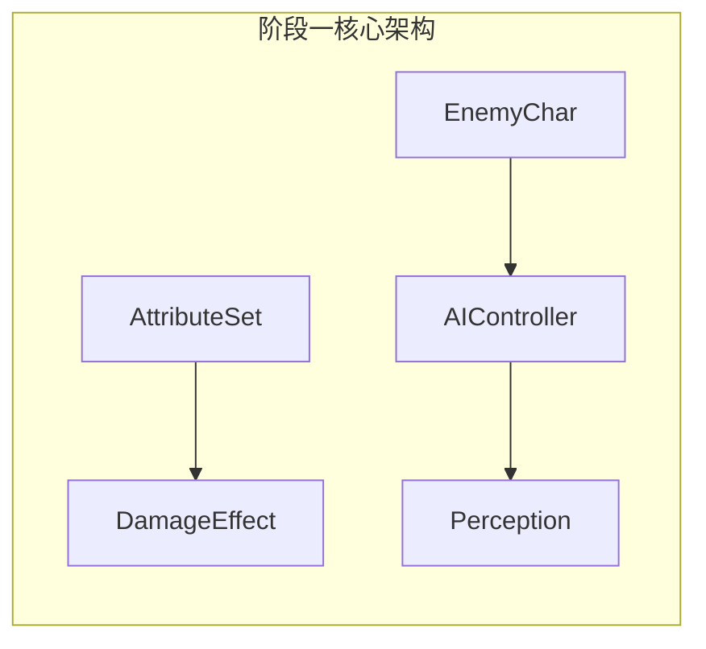
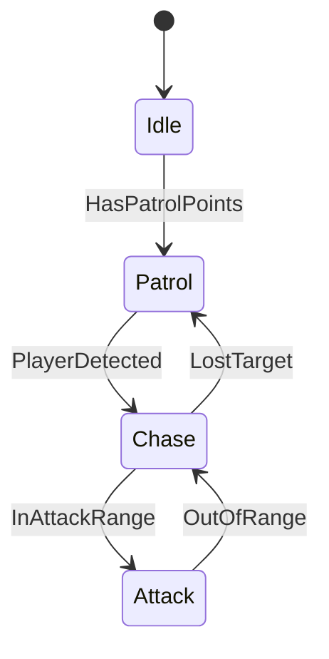

# UE5.5 GAS与State Tree AI 动作战斗Demo完整规划

## 项目现状分析

当前已有基础：

- 第三人称角色控制 ([UEDemoCharacter.cpp](Source/UEDemo/UEDemoCharacter.cpp))
- AbilitySystemComponent基础集成
- 简单的Combo攻击系统(7段攻击)
- Sprint技能与冷却Effect
- 丰富的动画资源(Frank武器套装)

---

## 阶段一：GAS核心基础 + AI框架搭建

### GAS部分

1. **AttributeSet属性系统**

- 创建 `UDemoAttributeSet` 包含：Health, MaxHealth, Stamina, MaxStamina, AttackPower, Defense
- 实现属性变化回调(OnRep)和Clamp逻辑
- 在Character中初始化和暴露属性

2. **GameplayEffect进阶**

- 创建伤害Effect(Instant)
- 创建持续消耗Effect(耐力恢复/消耗)
- 创建Buff/Debuff模板(Duration类型)

### AI部分

1. **AI基础架构**

- 创建 `AEnemyCharacter` 继承自Character
- 添加ASC到敌人角色
- 创建 `AEnemyAIController`

2. **感知系统**

- 配置 `UAIPerceptionComponent`
- 设置视觉和听觉感知
- 创建感知刺激响应逻辑



---

## 阶段二：战斗系统核心 + State Tree入门

### GAS部分

1. **伤害系统**

- 创建 `UDamageExecutionCalculation` 伤害计算类
- 实现攻击碰撞检测和目标选择
- 通过GameplayEffect应用伤害

2. **技能扩展**

- 闪避技能(消耗耐力，无敌帧)
- 防御技能(减伤状态)
- 重攻击(蓄力机制)

### AI部分

1. **State Tree基础**

- 创建第一个StateTree资产
- 实现基础状态：Idle、Patrol、Chase

2. **巡逻行为**

- 创建巡逻点系统
- 实现巡逻Task
- 状态切换条件设置



---

## 阶段三：GameplayCue视觉反馈 + AI战斗行为

### GAS部分

1. **GameplayCue系统**

- 创建 `UGameplayCueNotify_Static` 用于即时效果(受击火花)
- 创建 `AGameplayCueNotify_Actor` 用于持续效果(燃烧)
- 使用StarterContent中的粒子和音效

2. **Gameplay Tags完善**

- 设计完整的Tag层次结构
- 用Tag控制能力激活条件
- 实现能力之间的阻挡/取消关系

### AI部分

1. **战斗State Tree**

- 攻击决策节点
- 攻击动作执行
- 攻击后恢复/冷却

2. **简单战术**

- 距离判断(近战/后撤)
- 攻击时机选择
- 基础躲避反应

---

## 阶段四：AbilityTask异步任务 + AI高级行为

### GAS部分

1. **自定义AbilityTask**

- 蓄力攻击Task(按住释放)
- 目标追踪Task
- 等待事件Task

2. **技能连携系统**

- 技能触发技能(如闪避后可接反击)
- 技能组合效果(如连击增伤)

### AI部分

1. **躲避与防御**

- 识别玩家攻击前摇
- 执行闪避/格挡
- 状态打断与恢复

2. **状态机复杂化**

- 添加Hurt状态(受击硬直)
- 添加Guard状态(防御姿态)
- 实现状态优先级和打断逻辑

---

## 阶段五：网络同步基础 + AI配合行为

### GAS部分

1. **GAS网络同步**

- 理解Owner/Avatar分离
- Effect预测与回滚
- 属性同步策略

2. **PlayerState集成**

- 将ASC移至PlayerState
- 理解ActorInfo的正确设置
- 处理Possess/UnPossess

### AI部分

1. **多敌人协作**

- 进攻轮换系统(不同时攻击)
- 包围玩家的位置分配
- 简单的战术角色分工

2. **EQS环境查询**

- 创建EQS查询最佳攻击位置
- 掩体/躲避位置查询
- 与State Tree集成

---

## 阶段六：综合实战 + Boss战

### GAS部分

1. **复杂技能实现**

- 多段技能(如三连斩每段独立判定)
- 范围技能(AOE效果)
- 召唤技能(生成Entity)

2. **系统整合**

- UI绑定(血条、技能冷却)
- 战斗数值调优
- 完整战斗流程测试

### AI部分

1. **Boss设计**

- 多阶段State Tree
- 特殊技能模式
- 弱点与硬直系统

2. **战斗场景**

- 使用StarterMap搭建竞技场
- 敌人生成波次
- 简单战斗循环

---

## 推荐开发顺序

| 周次 | GAS重点 | AI重点 | 可测试成果 ||------|---------|--------|-----------|| 1-2 | AttributeSet + 伤害Effect | EnemyCharacter + 感知 | 玩家可对静态敌人造成伤害 || 3-4 | 闪避/防御技能 | State Tree巡逻/追击 | 敌人会追击并尝试攻击玩家 || 5-6 | GameplayCue | AI攻击行为 | 完整视觉反馈的战斗 || 7-8 | AbilityTask蓄力 | AI躲避/防御 | 有策略性的对战 || 9-10 | 技能连携 | 多敌人协作 | 多敌人挑战 || 11-12 | 复杂技能 | Boss | 完整战斗Demo |---

## 核心代码文件预期

```javascript
Source/UEDemo/
├── Abilities/
│   ├── AbilityBase.h/cpp          (已有)
│   ├── AttackAbility.h/cpp        (已有，需扩展)
│   ├── DodgeAbility.h/cpp         (新增)
│   ├── BlockAbility.h/cpp         (新增)
│   ├── ChargeAttackAbility.h/cpp  (新增)
│   └── Tasks/
│       ├── AT_WaitChargeInput.h/cpp
│       └── AT_PlayMontageAndWait.h/cpp
├── Attributes/
│   └── DemoAttributeSet.h/cpp     (新增)
├── Effects/
│   ├── GE_Damage.h/cpp            (新增)
│   ├── GE_StaminaCost.h/cpp       (新增)
│   └── Calculations/
│       └── DamageExecCalc.h/cpp   (新增)
├── Cues/
│   ├── GC_HitSpark.h/cpp          (新增)
│   └── GC_Burning.h/cpp           (新增)
├── AI/
│   ├── EnemyCharacter.h/cpp       (新增)
│   ├── EnemyAIController.h/cpp    (新增)
│   └── Tasks/
│       ├── STT_Patrol.h/cpp       (新增)
│       └── STT_Attack.h/cpp       (新增)
└── Types.h/cpp                    (扩展GameplayTags)


```